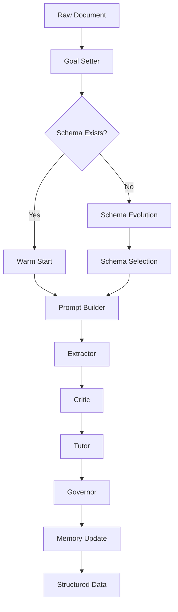

# Edgar-AI Extraction Pipeline

The extraction pipeline orchestrates the end-to-end process of transforming raw SEC documents into structured, queryable data through an ensemble of AI personas.

## Overview

The extraction pipeline implements the "data fly-wheel" pattern where each document processed improves the system's ability to handle future documents. This is achieved through:

1. **Goal-driven extraction**: AI determines what to extract
2. **Schema evolution**: Schemas improve based on feedback
3. **Continuous learning**: Critic feedback drives prompt improvements
4. **Adversarial hardening**: Synthetic edge cases strengthen the system

## Pipeline Flow



## Services

### Goal Setter
**Purpose**: Determine the primary analytical objective for a document

The Goal Setter reads the document and outputs a structured goal that guides all downstream processing:

```json
{
  "goal_id": "extract_credit_agreement_terms",
  "overview": "Extract key terms from credit facility agreement",
  "topics": ["loan amount", "interest rates", "covenants", "maturity"],
  "fields": [
    {"name": "principal_amount", "type": "currency"},
    {"name": "interest_rate", "type": "percentage"},
    {"name": "maturity_date", "type": "date"}
  ]
}
```

### Schema Evolution Engine
**Purpose**: Create and refine data schemas based on document patterns

This is a composite service that:
1. Generates multiple schema candidates (maximalist, minimalist, balanced)
2. Evaluates each against design principles
3. Selects the best schema for the goal
4. Continuously improves schemas based on usage

### Prompt Builder
**Purpose**: Convert schemas into optimized extraction prompts

Features:
- Dynamic field enumeration
- Token budget management
- Function-calling format for structured output
- Persona-specific instructions

### Extractor
**Purpose**: Execute the extraction using LLMs

Capabilities:
- Large-context document processing
- Structured output via function calling
- Automatic validation and retry
- Full lineage tracking

### Critic
**Purpose**: Evaluate extraction quality and provide feedback

The Critic:
- Re-reads the original document
- Grades each extracted value
- Identifies patterns in errors
- Generates improvement suggestions

### Tutor
**Purpose**: Generate improved prompts based on Critic feedback

When errors accumulate, the Tutor:
- Analyzes error patterns
- Rewrites problematic prompt sections
- Creates challenger prompts for A/B testing
- Submits improvements for Governor approval

### Governor
**Purpose**: Quality gates and promotion decisions

The Governor:
- Enforces minimum quality thresholds
- Manages champion/challenger testing
- Decides when to promote new prompts
- Triggers back-correction when needed

### Breaker
**Purpose**: Generate adversarial test cases

The Breaker:
- Creates synthetic documents designed to break extractors
- Tests edge cases before they appear in production
- Forces continuous improvement
- Ensures robustness

## Configuration

```python
# In edgar/config.py
EDGAR_GOAL_SETTER_MODEL = "gpt-4-turbo-preview"
EDGAR_EXTRACTOR_MODEL = "gpt-4-turbo-preview"
EDGAR_CRITIC_MODEL = "claude-3-opus"
EDGAR_ENABLE_SCHEMA_EVOLUTION = true
EDGAR_SCHEMA_PROMOTION_THRESHOLD = 10
```

## Usage

### Basic Extraction

```python
from extraction.orchestrator import ExtractionPipeline
from interfaces.models import Document

pipeline = ExtractionPipeline()

# Process a single document
document = Document(
    id="doc123",
    text="CREDIT AGREEMENT dated as of March 15, 2024...",
    metadata={"type": "credit_agreement"}
)

result = await pipeline.process(document)
print(result.rows)  # Structured data
print(result.schema)  # Schema used
print(result.critic_notes)  # Quality feedback
```

### Batch Processing

```python
# Process multiple documents
documents = load_documents("path/to/filings/")
results = await pipeline.process_batch(documents, max_concurrent=5)

# Export to DataFrame
df = pipeline.to_dataframe(results)
df.to_parquet("extracted_data.parquet")
```

### Schema Management

```python
from extraction.services.schema_evolution import SchemaEvolution

evolution = SchemaEvolution()

# View current schemas
schemas = await evolution.list_schemas()

# Promote a field candidate
await evolution.promote_field("debt_to_equity_ratio", goal_id="financial_ratios")

# Trigger back-correction
await evolution.backfill_with_new_schema(schema_id="schema_v2")
```

## Monitoring

Key metrics to track:

- **Extraction Success Rate**: Percentage of documents successfully processed
- **Schema Hit Rate**: Percentage using warm-start vs cold-start
- **Critic Scores**: Average quality scores from the Critic
- **Prompt Evolution**: Number of prompt improvements over time
- **Token Efficiency**: Tokens used per extracted field

## Best Practices

1. **Let AI Drive**: Don't pre-define extraction targets; let Goal Setter decide
2. **Trust the Process**: Schema evolution takes time but yields better results
3. **Monitor Critic Feedback**: Low scores indicate areas for improvement
4. **Regular Adversarial Testing**: Run Breaker weekly to stay ahead of edge cases
5. **Version Everything**: Keep full history of schemas and prompts

## Troubleshooting

### Low Extraction Quality
- Check Critic feedback for patterns
- Review schema design principles
- Consider adjusting temperature settings

### Slow Processing
- Enable warm-start by building schema memory
- Increase concurrent processing
- Use appropriate models for each persona

### Schema Drift
- Monitor schema evolution metrics
- Set appropriate promotion thresholds
- Review Governor decisions

## Future Enhancements

1. **Multi-Modal Extraction**: Tables, charts, and images
2. **Cross-Document Reasoning**: Link related filings
3. **Real-Time Processing**: Stream processing for live feeds
4. **Custom Personas**: Domain-specific extraction experts